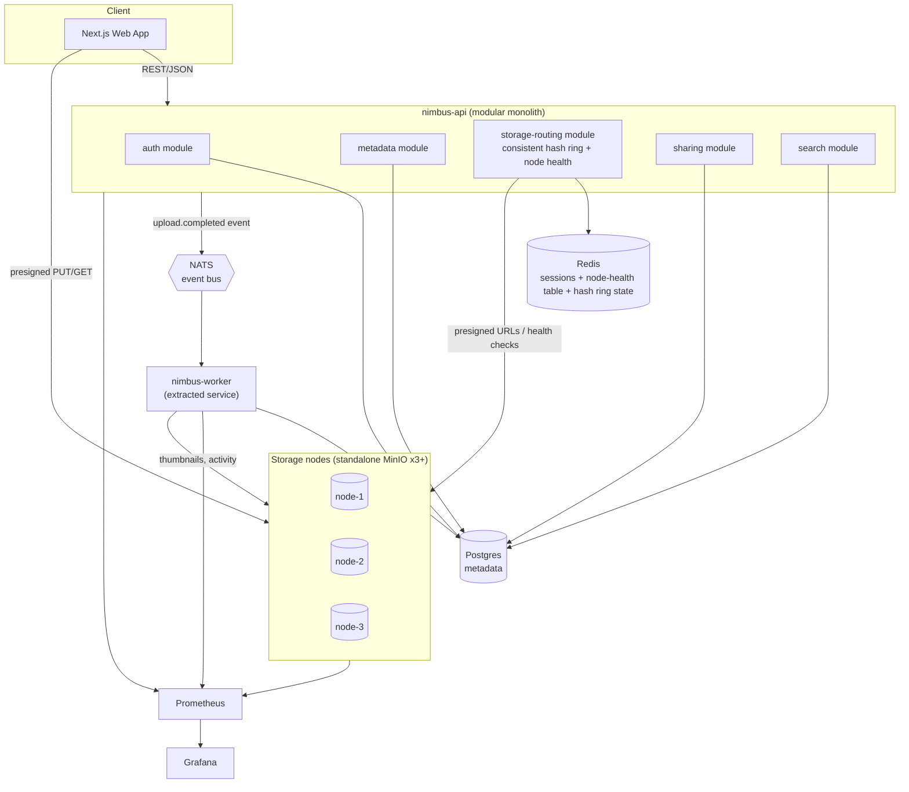
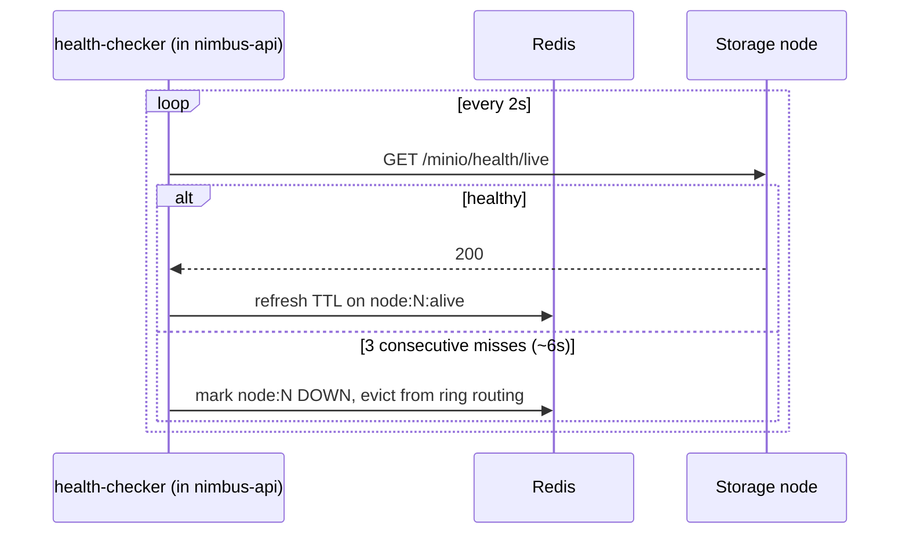
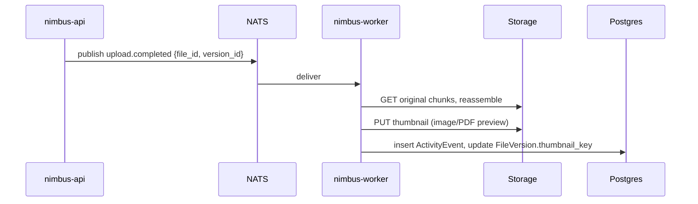

# System Design — Nimbus Storage Platform

Status: current as of Day 11 — all decisions below implemented as described
Version: 0.3
Depends on: [01-srs.md](01-srs.md)

## 1. Component diagram



**Why a modular monolith with one real extraction, not 8 services**: at this traffic level, network hops between services buy nothing but latency and failure modes to handle. The worker is split out because it has a genuinely different scaling axis (CPU-bound thumbnailing vs. I/O-bound API traffic) and consumes events rather than serving requests — a real reason to separate it, not a default.

**Why standalone MinIO nodes, not a MinIO distributed cluster**: MinIO's own distributed mode already does erasure-coded replication and failover internally — deploying it that way would get us fault tolerance "for free" but with none of it being code we wrote or can reason about. Since the placement/replication/failover logic *is* the point of this project, each MinIO node here runs standalone (a dumb single-node object store), and Nimbus's `storage-routing` module owns consistent hashing, replica placement, health checking, and failover itself. This is a deliberate trade of "less production-hardened" for "actually demonstrates the skill."

## 2. Storage layer design

### 2.1 Chunking & content addressing
- Files are split client-side into fixed-size chunks (default 8 MiB, configurable, last chunk smaller).
- Each chunk is hashed with SHA-256; that hash is its content ID.
- Dedup: before upload, client calls `POST /chunks/check` with a list of chunk hashes; API returns which already exist (globally, across users) so the client skips re-uploading them.

### 2.2 Placement: consistent hashing with a preference list
- A hash ring (SHA-1 of node ID, 128 virtual nodes per physical node for balance) maps a chunk hash to a position on the ring.
- Replica placement follows the Dynamo-style preference list: walk clockwise from the chunk's ring position, collecting the first **N=2 distinct, currently-healthy** physical nodes.
- Ring + live node-health table are stored in Redis so the design tolerates running >1 `nimbus-api` replica later, even though the demo runs one.

### 2.3 Write path
```mermaid
sequenceDiagram
    participant C as Client
    participant A as nimbus-api
    participant R as Redis (ring/health)
    participant S1 as Node A
    participant S2 as Node B

    C->>A: POST /chunks/check {hashes[]}
    A-->>C: {missing hashes[]}
    C->>A: POST /uploads/{id}/chunk-init {hash}
    A->>R: resolve N=2 healthy nodes for hash
    A-->>C: presigned PUT x2 (Node A, Node B)
    par direct upload
        C->>S1: PUT chunk (presigned)
        C->>S2: PUT chunk (presigned)
    end
    C->>A: POST /uploads/{id}/chunk-commit {hash, etags}
    A->>A: verify checksum vs etags
    A->>PG: record chunk + replica locations, mark committed
    Note over A: write quorum W=2 in the happy path;<br/>if one target is down at placement time,<br/>ring walk already skipped it (degrade to<br/>a healthy pair rather than fail the write)
```

- Quorum: both selected replicas must ack before the chunk is committed (W=2 of N=2). If a designated node is already marked unhealthy, the ring walk substitutes the next healthy node *before* issuing presigned URLs — the client never targets a known-dead node.
- If a node dies mid-write (after presigning, before ack), the commit fails for that chunk and the client retries `chunk-init`, which re-resolves against current health state.

### 2.4 Read path
- API resolves the file's chunk list (from Postgres) and, for each chunk, its replica locations.
- For each chunk, the API picks the first replica marked healthy and returns a presigned GET; client downloads directly from the storage node.
- If a presigned GET 5xxs (node died between health check and download), the client falls back to the next replica in the list — the API returns both replica URLs, not just one, so this doesn't require a round trip back to the API.

### 2.5 Failure detection & failover

- A down node is excluded from new placements immediately; it is **not** proactively re-replicated onto a new node automatically — that's out of scope for v1 (see SRS §4/§6). Existing chunks on a down node just have reduced redundancy until it comes back or a manual repair is run: `POST /v1/admin/nodes/{nodeId}/repair` (built in the architecture-gap session, `internal/storage/repair.go`) re-verifies every chunk that node is recorded as holding and re-copies from a surviving replica whatever's physically missing — this doc had described "a manual re-replication script" here since the original write-up, before one actually existed; it's now real, an HTTP endpoint rather than a standalone script, still deliberately manual-trigger rather than automatic-on-recovery (see the file's own doc comment for the repair-storm reasoning).
- Placement itself is latency-tiered as of the same session: `Router.Resolve` prefers healthy nodes whose rolling probe-latency EWMA is under a threshold (`NIMBUS_STORAGE_SLOW_THRESHOLD`, default 200ms), falling back to a technically-alive-but-slow node only when the fast tier can't fill the quorum — previously every healthy node was treated identically regardless of how slow its probes had gotten.
- This is the mechanism exercised by the chaos scenario (SRS FR-21): kill a node mid-transfer, show writes/reads continue on the remaining replica, bring the node back, and demonstrate reads are still correct via checksum verification.

## 3. Metadata & consistency model

- **Metadata (files, folders, versions, shares, users) is strongly consistent**: single Postgres instance, ACID transactions, e.g. a folder rename/move is one transaction so search/listing never sees a half-moved tree.
- **Chunk content is AP-leaning**: writes succeed once W=2 of the *currently healthy* replica set ack, not once N=2 of the *originally intended* replica set ack. This means during a node outage the system chooses availability (accept the write against whatever healthy nodes exist) over strict durability guarantees against the original placement — a deliberate CAP trade, stated so it can be defended rather than discovered by an interviewer.
- Why Postgres over a NoSQL store for metadata: folder hierarchies and move/rename need transactional, referential integrity (a file can't reference a deleted folder mid-move); the metadata volume here is nowhere near a scale that needs Postgres's consistency traded away.

## 4. Data model (entities, detailed schema in Phase 6)

`User`, `Organization`, `Membership(role)`, `Folder(parent_id, org_id)`, `File(folder_id, latest_version_id)`, `FileVersion(file_id, size, checksum)`, `Chunk(hash, size)`, `FileVersionChunk(version_id, chunk_hash, sequence)`, `ChunkLocation(chunk_hash, node_id, status)`, `StorageNode(id, endpoint, status)`, `ShareLink(file_id, token, expiry)`, `ActivityEvent(org_id, actor, verb, target, ts)`.

## 5. API surface overview (contract detail in Phase 7)

REST/JSON over the modular monolith: `/auth/*`, `/orgs/*`, `/folders/*`, `/files/*`, `/uploads/*` (chunk-check, chunk-init, chunk-commit, complete), `/chunks/check`, `/shares/*`, `/search`, `/activity`, `/admin/nodes` (health view). No gRPC in v1 (SRS non-goal) — noted as a roadmap item since the module boundaries are already clean enough to grow a gRPC facade later without a rewrite.

## 6. Async processing flow


- At-least-once delivery assumed (NATS JetStream with ack); thumbnail generation is idempotent (deterministic output key per version), so redelivery is safe without dedup logic.

## 7. Observability — built Day 11

- Every request gets a request ID propagated through logs (structured JSON, `slog`).
- Prometheus metrics: HTTP histogram (route, status, latency), upload throughput, chunk placement failures, node health gauge per node, NATS consumer lag. See docs/03-hld.md §2 for the exact metric names and label choices.
- Grafana: one dashboard for API/worker golden signals (`nimbus-golden-signals`), one for storage-node health/replication status (`nimbus-storage-health`) — this second one is what's on screen during the chaos demo. Both auto-provisioned from `deploy/observability/grafana/` — no manual Grafana setup needed after `docker compose up`.
- The `Storage --> PROM` arrow in the diagram above is satisfied by nimbus's own `nimbus_storage_node_healthy` gauge (emitted by `nimbus-api`/`nimbus-worker`), not by scraping MinIO's built-in metrics endpoint — the latter was never in scope for this day, since the demo cares about the placement/failover decision nimbus itself makes, not raw MinIO server stats.

## 8. Scalability discussion — from demo-scale to the original 10M user / 100 PB target

This system is built and demonstrated at laptop scale (§NFR in the SRS). Here's what would actually change to approach the original brief's numbers, stated honestly as *design direction*, not as something implemented here:

| Concern | Demo-scale (built) | At 10M users / 100PB (not built) |
|---|---|---|
| API | 1 instance, in-process modules | Many stateless replicas behind a load balancer; Redis-backed ring/health already makes this safe |
| Metadata store | Single Postgres | Sharded/partitioned Postgres (by org_id) or a distributed SQL store (CockroachDB/Spanner-alike); read replicas |
| Storage nodes | 3 standalone MinIO, N=2 full replication | Dozens–hundreds of nodes, erasure coding (e.g. Reed-Solomon) instead of full replication to cut storage overhead from 2x to ~1.4x |
| Ring/health coordination | Redis, single source of truth | A proper coordination service (etcd/Consul) with real leader election for the routing control plane, since a single Redis becomes a bottleneck/SPOF |
| Failover | Heartbeat + manual re-replication | Automated background re-replication/rebalancing when a node is lost for good |
| Downloads | Direct presigned URL to node | CDN in front of storage nodes for hot objects |
| Chaos | One scripted scenario | Continuous chaos engineering (e.g. scheduled node kills in staging) |
| Deployment | Docker Compose / kind locally | Multi-region Kubernetes, Terraform-managed, autoscaling (HPA/KEDA on queue depth) |

The point of this table: the demo-scale design isn't a toy that happens to look like the real thing — the consistent-hashing/replication/failover mechanism is the same *mechanism* used at scale, just with fewer nodes and a simpler coordination layer. What changes going to scale is coordination infrastructure and storage efficiency, not the core algorithm.

## 9. Resolved decisions (formerly "open questions")

All confirmed and implemented as originally proposed:
1. Chunk size default 8 MiB (`NIMBUS_CHUNK_SIZE_BYTES`, client-side chunking in `frontend/lib/upload.ts` matches).
2. Replication factor N=2 / write quorum W=2 (`NIMBUS_REPLICATION_FACTOR`/`NIMBUS_WRITE_QUORUM`), cross-replica ETag check on commit.
3. Standalone-MinIO-plus-custom-routing — implemented exactly as described in §1; `internal/storage` owns the ring/health/placement logic.
