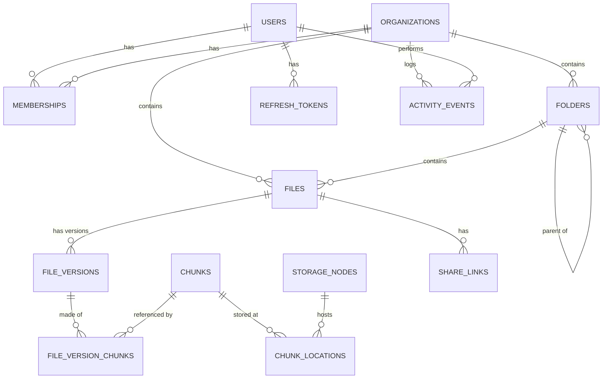

# Database Design — Nimbus Storage Platform

Status: DRAFT
Version: 0.1
Depends on: [02-system-design.md](02-system-design.md) §4, [04-lld.md](04-lld.md) §3

Single Postgres database (per §3 of System Design: strong consistency for the hierarchical/transactional parts). All tables use `uuid` PKs (via `gen_random_uuid()`, `pgcrypto`) except append-only/high-volume tables (`activity_events`) which use `bigserial`, and content-addressed tables (`chunks`, `chunk_locations`) which are keyed by hash/node directly.

## 1. ER diagram



## 2. Schema

```sql
CREATE EXTENSION IF NOT EXISTS pgcrypto;

CREATE TABLE users (
    id            uuid PRIMARY KEY DEFAULT gen_random_uuid(),
    email         citext UNIQUE NOT NULL,
    password_hash text NOT NULL,
    created_at    timestamptz NOT NULL DEFAULT now()
);

CREATE TABLE organizations (
    id            uuid PRIMARY KEY DEFAULT gen_random_uuid(),
    name          text NOT NULL,
    owner_user_id uuid NOT NULL REFERENCES users(id),
    created_at    timestamptz NOT NULL DEFAULT now()
);

CREATE TYPE member_role AS ENUM ('owner', 'member');

CREATE TABLE memberships (
    org_id     uuid NOT NULL REFERENCES organizations(id) ON DELETE CASCADE,
    user_id    uuid NOT NULL REFERENCES users(id) ON DELETE CASCADE,
    role       member_role NOT NULL DEFAULT 'member',
    created_at timestamptz NOT NULL DEFAULT now(),
    PRIMARY KEY (org_id, user_id)
);

CREATE TABLE folders (
    id         uuid PRIMARY KEY DEFAULT gen_random_uuid(),
    org_id     uuid NOT NULL REFERENCES organizations(id) ON DELETE CASCADE,
    parent_id  uuid REFERENCES folders(id) ON DELETE CASCADE, -- null = root
    name       text NOT NULL,
    created_at timestamptz NOT NULL DEFAULT now(),
    updated_at timestamptz NOT NULL DEFAULT now(),
    deleted_at timestamptz -- soft delete (trash)
);
CREATE INDEX idx_folders_parent ON folders (org_id, parent_id) WHERE deleted_at IS NULL;
-- one non-deleted folder per (parent, name):
CREATE UNIQUE INDEX uq_folders_sibling_name ON folders (org_id, COALESCE(parent_id, '00000000-0000-0000-0000-000000000000'), lower(name))
    WHERE deleted_at IS NULL;

CREATE TABLE files (
    id                 uuid PRIMARY KEY DEFAULT gen_random_uuid(),
    org_id             uuid NOT NULL REFERENCES organizations(id) ON DELETE CASCADE,
    folder_id          uuid NOT NULL REFERENCES folders(id) ON DELETE CASCADE,
    name               text NOT NULL,
    latest_version_id  uuid, -- FK added after file_versions exists (see ALTER below)
    created_by         uuid NOT NULL REFERENCES users(id),
    created_at         timestamptz NOT NULL DEFAULT now(),
    updated_at         timestamptz NOT NULL DEFAULT now(),
    deleted_at         timestamptz,
    -- Punctuation stripped before tokenizing: Postgres's default parser
    -- treats a dotted/hyphenated string like "photo-alpha.png" as one
    -- opaque "file" token, so a plain word search for "photo" would never
    -- match it otherwise (found by running search in Day 8, not a
    -- theoretical concern — see migration 000004).
    name_tsv           tsvector GENERATED ALWAYS AS (to_tsvector('simple', regexp_replace(name, '[^a-zA-Z0-9]+', ' ', 'g'))) STORED
);
CREATE INDEX idx_files_folder ON files (folder_id) WHERE deleted_at IS NULL;
CREATE INDEX idx_files_search ON files USING GIN (name_tsv);
CREATE INDEX idx_files_org_deleted ON files (org_id) WHERE deleted_at IS NOT NULL; -- trash listing

CREATE TABLE file_versions (
    id             uuid PRIMARY KEY DEFAULT gen_random_uuid(),
    file_id        uuid NOT NULL REFERENCES files(id) ON DELETE CASCADE,
    size_bytes     bigint NOT NULL,
    checksum_sha256 char(64) NOT NULL,
    mime_type      text NOT NULL,
    thumbnail_key  text, -- set by worker after async processing
    created_by     uuid NOT NULL REFERENCES users(id),
    created_at     timestamptz NOT NULL DEFAULT now()
);
CREATE INDEX idx_file_versions_file ON file_versions (file_id, created_at DESC);

ALTER TABLE files ADD CONSTRAINT fk_files_latest_version
    FOREIGN KEY (latest_version_id) REFERENCES file_versions(id);

-- global content-addressed chunk store (enables cross-user dedup, FR-7)
CREATE TABLE chunks (
    hash       char(64) PRIMARY KEY, -- sha256 hex
    size_bytes int NOT NULL,
    created_at timestamptz NOT NULL DEFAULT now()
);

CREATE TABLE file_version_chunks (
    version_id uuid NOT NULL REFERENCES file_versions(id) ON DELETE CASCADE,
    sequence   int NOT NULL,
    chunk_hash char(64) NOT NULL REFERENCES chunks(hash),
    PRIMARY KEY (version_id, sequence)
);

CREATE TYPE node_status AS ENUM ('healthy', 'down');

CREATE TABLE storage_nodes (
    id                text PRIMARY KEY, -- NodeID
    endpoint          text NOT NULL,
    status            node_status NOT NULL DEFAULT 'healthy',
    last_heartbeat_at timestamptz
);

CREATE TYPE chunk_location_status AS ENUM ('committed', 'degraded');

CREATE TABLE chunk_locations (
    chunk_hash char(64) NOT NULL REFERENCES chunks(hash) ON DELETE CASCADE,
    node_id    text NOT NULL REFERENCES storage_nodes(id),
    status     chunk_location_status NOT NULL DEFAULT 'committed',
    created_at timestamptz NOT NULL DEFAULT now(),
    PRIMARY KEY (chunk_hash, node_id)
);
CREATE INDEX idx_chunk_locations_node ON chunk_locations (node_id); -- admin node-usage queries

CREATE TABLE share_links (
    id         uuid PRIMARY KEY DEFAULT gen_random_uuid(),
    file_id    uuid NOT NULL REFERENCES files(id) ON DELETE CASCADE,
    token      char(43) UNIQUE NOT NULL, -- base64url(32 random bytes)
    created_by uuid NOT NULL REFERENCES users(id),
    expires_at timestamptz,
    created_at timestamptz NOT NULL DEFAULT now()
);

CREATE TABLE activity_events (
    id             bigserial PRIMARY KEY,
    org_id         uuid NOT NULL REFERENCES organizations(id) ON DELETE CASCADE,
    actor_user_id  uuid REFERENCES users(id), -- null = system/worker-generated
    verb           text NOT NULL, -- 'uploaded' | 'shared' | 'restored' | 'deleted' | ...
    target_type    text NOT NULL, -- 'file' | 'folder'
    target_id      uuid NOT NULL,
    created_at     timestamptz NOT NULL DEFAULT now()
);
CREATE INDEX idx_activity_org_time ON activity_events (org_id, created_at DESC);

CREATE TABLE refresh_tokens (
    id          uuid PRIMARY KEY DEFAULT gen_random_uuid(),
    user_id     uuid NOT NULL REFERENCES users(id) ON DELETE CASCADE,
    family_id   uuid NOT NULL,
    token_hash  char(64) UNIQUE NOT NULL, -- sha256 hex of the opaque token
    used_at     timestamptz,
    expires_at  timestamptz NOT NULL,
    created_at  timestamptz NOT NULL DEFAULT now()
);
CREATE INDEX idx_refresh_tokens_family ON refresh_tokens (family_id);
```

## 3. Design notes

- **Dedup correctness**: `chunks` is global (not per-org) — the interesting claim ("dedup across users at the chunk level," SRS FR-7) lives entirely in `file_version_chunks` mapping many versions/files/orgs to the same `chunks.hash`. Deleting a file never deletes a `chunks` row directly; a chunk is only eligible for physical GC when no `file_version_chunks` row references it (documented as a manual/roadmap job per SRS §4, not automated in v1).
- **Trash/restore** (FR-11) is `deleted_at` soft-delete on `folders`/`files`; restore clears it; permanent purge is a scheduled query (`deleted_at < now() - retention_window`) run by a cron-style job in the worker, not a DB trigger — keeps the deletion policy in application code where it's easier to test.
- **Why a `chunk_locations` join table instead of an array column on `chunks`**: needs to be queried from the `storage_nodes` side too (admin view: "what's on node X," HLD `admin.NodeStatus()`), and needs its own `status` for the degraded-replica case after a failover — an array on `chunks` can't represent that cleanly.
- **Search** (FR-15/16) uses Postgres full-text (`tsvector`/GIN) on file name only for v1 — sufficient at this scale; a dedicated search engine (Elasticsearch/Meilisearch) is a roadmap item if fielded search grows beyond name/type/date/size filters.
- **Folder uniqueness** uses a placeholder nil-UUID sentinel for root's `parent_id` in the partial unique index because Postgres unique indexes treat `NULL` as distinct values (two root folders named "X" would otherwise both be allowed) — a real gotcha worth knowing, not just boilerplate.

## 4. Open question for sign-off

Retention window for permanent trash purge (FR-11) — defaulting to 30 days unless you want something else (or configurable via `NIMBUS_TRASH_RETENTION_DAYS` env, which is easy either way).
