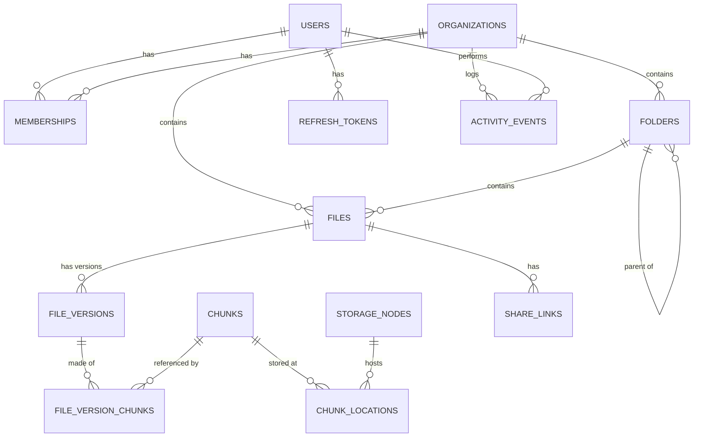

# Database Design — Nimbus Storage Platform

Status: current as of governance session part 2, 2026-07-06 (§2 covers migrations 000001-000013; see docs/00-project-state.md for the live summary)
Version: 0.7
Depends on: [02-system-design.md](02-system-design.md) §4, [04-lld.md](04-lld.md) §3

Single Postgres database (per §3 of System Design: strong consistency for the hierarchical/transactional parts). All tables use `uuid` PKs (via `gen_random_uuid()`, `pgcrypto`) except append-only/high-volume tables (`activity_events`) which use `bigserial`, and content-addressed tables (`chunks`, `chunk_locations`) which are keyed by hash/node directly.

## 1. ER diagram



## 2. Schema

```sql
CREATE EXTENSION IF NOT EXISTS pgcrypto;

CREATE TABLE users (
    id            uuid PRIMARY KEY DEFAULT gen_random_uuid(),
    email         citext UNIQUE NOT NULL,
    password_hash text NOT NULL,
    created_at    timestamptz NOT NULL DEFAULT now()
);

CREATE TABLE organizations (
    id            uuid PRIMARY KEY DEFAULT gen_random_uuid(),
    name          text NOT NULL,
    owner_user_id uuid NOT NULL REFERENCES users(id),
    created_at    timestamptz NOT NULL DEFAULT now()
);

CREATE TYPE member_role AS ENUM ('owner', 'member'); -- 'admin' added by migration 000013 (§2.9)

CREATE TABLE memberships (
    org_id     uuid NOT NULL REFERENCES organizations(id) ON DELETE CASCADE,
    user_id    uuid NOT NULL REFERENCES users(id) ON DELETE CASCADE,
    role       member_role NOT NULL DEFAULT 'member',
    created_at timestamptz NOT NULL DEFAULT now(),
    PRIMARY KEY (org_id, user_id)
);

CREATE TABLE folders (
    id         uuid PRIMARY KEY DEFAULT gen_random_uuid(),
    org_id     uuid NOT NULL REFERENCES organizations(id) ON DELETE CASCADE,
    parent_id  uuid REFERENCES folders(id) ON DELETE CASCADE, -- null = root
    name       text NOT NULL,
    created_at timestamptz NOT NULL DEFAULT now(),
    updated_at timestamptz NOT NULL DEFAULT now(),
    deleted_at timestamptz -- soft delete (trash)
);
CREATE INDEX idx_folders_parent ON folders (org_id, parent_id) WHERE deleted_at IS NULL;
-- one non-deleted folder per (parent, name):
CREATE UNIQUE INDEX uq_folders_sibling_name ON folders (org_id, COALESCE(parent_id, '00000000-0000-0000-0000-000000000000'), lower(name))
    WHERE deleted_at IS NULL;

CREATE TABLE files (
    id                 uuid PRIMARY KEY DEFAULT gen_random_uuid(),
    org_id             uuid NOT NULL REFERENCES organizations(id) ON DELETE CASCADE,
    folder_id          uuid NOT NULL REFERENCES folders(id) ON DELETE CASCADE,
    name               text NOT NULL,
    latest_version_id  uuid, -- FK added after file_versions exists (see ALTER below)
    created_by         uuid NOT NULL REFERENCES users(id),
    created_at         timestamptz NOT NULL DEFAULT now(),
    updated_at         timestamptz NOT NULL DEFAULT now(),
    deleted_at         timestamptz,
    -- Punctuation stripped before tokenizing: Postgres's default parser
    -- treats a dotted/hyphenated string like "photo-alpha.png" as one
    -- opaque "file" token, so a plain word search for "photo" would never
    -- match it otherwise (found by running search in Day 8, not a
    -- theoretical concern — see migration 000004).
    name_tsv           tsvector GENERATED ALWAYS AS (to_tsvector('simple', regexp_replace(name, '[^a-zA-Z0-9]+', ' ', 'g'))) STORED
);
CREATE INDEX idx_files_folder ON files (folder_id) WHERE deleted_at IS NULL;
CREATE INDEX idx_files_search ON files USING GIN (name_tsv);
CREATE INDEX idx_files_org_deleted ON files (org_id) WHERE deleted_at IS NOT NULL; -- trash listing

CREATE TABLE file_versions (
    id             uuid PRIMARY KEY DEFAULT gen_random_uuid(),
    file_id        uuid NOT NULL REFERENCES files(id) ON DELETE CASCADE,
    size_bytes     bigint NOT NULL,
    checksum_sha256 char(64) NOT NULL,
    mime_type      text NOT NULL,
    thumbnail_key  text, -- set by worker after async processing
    created_by     uuid NOT NULL REFERENCES users(id),
    created_at     timestamptz NOT NULL DEFAULT now()
);
CREATE INDEX idx_file_versions_file ON file_versions (file_id, created_at DESC);

ALTER TABLE files ADD CONSTRAINT fk_files_latest_version
    FOREIGN KEY (latest_version_id) REFERENCES file_versions(id);

-- global content-addressed chunk store (enables cross-user dedup, FR-7)
-- gc_state/last_seen_at/doomed_at added by migration 000007 (chunk GC,
-- backlog #10) — see §2.4 and docs/07-distributed-architecture.md §6.
CREATE TABLE chunks (
    hash         char(64) PRIMARY KEY, -- sha256 hex
    size_bytes   int NOT NULL,
    created_at   timestamptz NOT NULL DEFAULT now(),
    gc_state     chunk_gc_state NOT NULL DEFAULT 'live', -- 'live' | 'doomed'
    last_seen_at timestamptz NOT NULL DEFAULT now(),     -- dedup-lease clock
    doomed_at    timestamptz
);

CREATE TABLE file_version_chunks (
    version_id uuid NOT NULL REFERENCES file_versions(id) ON DELETE CASCADE,
    sequence   int NOT NULL,
    chunk_hash char(64) NOT NULL REFERENCES chunks(hash),
    PRIMARY KEY (version_id, sequence)
);

CREATE TYPE node_status AS ENUM ('healthy', 'down');

CREATE TABLE storage_nodes (
    id                text PRIMARY KEY, -- NodeID
    endpoint          text NOT NULL,
    status            node_status NOT NULL DEFAULT 'healthy',
    last_heartbeat_at timestamptz
);

CREATE TYPE chunk_location_status AS ENUM ('committed', 'degraded');

CREATE TABLE chunk_locations (
    chunk_hash char(64) NOT NULL REFERENCES chunks(hash) ON DELETE CASCADE,
    node_id    text NOT NULL REFERENCES storage_nodes(id),
    status     chunk_location_status NOT NULL DEFAULT 'committed',
    created_at timestamptz NOT NULL DEFAULT now(),
    PRIMARY KEY (chunk_hash, node_id)
);
CREATE INDEX idx_chunk_locations_node ON chunk_locations (node_id); -- admin node-usage queries

CREATE TABLE share_links (
    id         uuid PRIMARY KEY DEFAULT gen_random_uuid(),
    file_id    uuid NOT NULL REFERENCES files(id) ON DELETE CASCADE,
    token      char(43) UNIQUE NOT NULL, -- base64url(32 random bytes)
    created_by uuid NOT NULL REFERENCES users(id),
    expires_at timestamptz,
    created_at timestamptz NOT NULL DEFAULT now()
);

CREATE TABLE activity_events (
    id             bigserial PRIMARY KEY,
    org_id         uuid NOT NULL REFERENCES organizations(id) ON DELETE CASCADE,
    actor_user_id  uuid REFERENCES users(id), -- null = system/worker-generated
    verb           text NOT NULL, -- 'uploaded' | 'shared' | 'restored' | 'deleted' | ...
    target_type    text NOT NULL, -- 'file' | 'folder'
    target_id      uuid NOT NULL,
    created_at     timestamptz NOT NULL DEFAULT now()
);
CREATE INDEX idx_activity_org_time ON activity_events (org_id, created_at DESC);

CREATE TABLE refresh_tokens (
    id          uuid PRIMARY KEY DEFAULT gen_random_uuid(),
    user_id     uuid NOT NULL REFERENCES users(id) ON DELETE CASCADE,
    family_id   uuid NOT NULL,
    token_hash  char(64) UNIQUE NOT NULL, -- sha256 hex of the opaque token
    used_at     timestamptz,
    expires_at  timestamptz NOT NULL,
    created_at  timestamptz NOT NULL DEFAULT now()
);
CREATE INDEX idx_refresh_tokens_family ON refresh_tokens (family_id);
```

### 2.1 Added in migration 000002 — upload session bookkeeping (Day 5)

Not anticipated by the original schema above — upload-session/chunk-attempt state needed a home. See `internal/upload/repository.go`.

```sql
CREATE TYPE upload_status AS ENUM ('in_progress', 'completed', 'aborted');

CREATE TABLE uploads (
    id                  uuid PRIMARY KEY DEFAULT gen_random_uuid(),
    org_id              uuid NOT NULL REFERENCES organizations(id) ON DELETE CASCADE,
    folder_id           uuid NOT NULL REFERENCES folders(id) ON DELETE CASCADE,
    name                text NOT NULL,
    declared_size_bytes bigint NOT NULL,
    mime_type           text NOT NULL,
    created_by          uuid NOT NULL REFERENCES users(id),
    status              upload_status NOT NULL DEFAULT 'in_progress',
    idempotency_key     text,
    file_id             uuid REFERENCES files(id),
    version_id          uuid REFERENCES file_versions(id),
    created_at          timestamptz NOT NULL DEFAULT now()
);
CREATE UNIQUE INDEX uq_uploads_idempotency_key ON uploads (created_by, idempotency_key)
    WHERE idempotency_key IS NOT NULL;

CREATE TYPE chunk_attempt_state AS ENUM ('pending', 'presigned', 'committed');

CREATE TABLE upload_chunks (
    upload_id  uuid NOT NULL REFERENCES uploads(id) ON DELETE CASCADE,
    chunk_hash char(64) NOT NULL,
    state      chunk_attempt_state NOT NULL DEFAULT 'pending',
    etags      jsonb,
    created_at timestamptz NOT NULL DEFAULT now(),
    updated_at timestamptz NOT NULL DEFAULT now(),
    PRIMARY KEY (upload_id, chunk_hash)
);
```

### 2.2 Added in migration 000003 — re-upload as a new version (Day 6)

```sql
ALTER TABLE uploads ADD COLUMN target_file_id uuid REFERENCES files(id);
```
Non-null means this upload adds a version to an existing file rather than creating one — see `upload.Service.InitUpload`.

### 2.3 Migration 000004 — search tokenization fix (Day 8)

`files.name_tsv`'s definition in §2 above already reflects the *fixed* version. The original generated column (`to_tsvector('simple', name)`) had a real bug: Postgres's default parser treats a dotted/hyphenated filename like `photo-alpha.png` as one opaque token, so a plain-word search for "photo" never matched it. Migration 000004 rebuilds the column with `regexp_replace(name, '[^a-zA-Z0-9]+', ' ', 'g')` applied first. Found by actually running search (Day 8), not a theoretical concern.

### 2.4 Migrations 000005/000006 — auth audit log (Day 15) and dead events (Tier 2)

Documented with their owning modules rather than here: `auth_audit_log` (000005) in docs/01-srs.md FR-4 / docs/00-project-state.md item 15, `dead_events` (000006, the Postgres-table DLQ) in docs/07-distributed-architecture.md §3. Both are single self-contained tables with no FKs into the schema above.

### 2.5 Migrations 000007/000008 — chunk GC + the uploads purge-blocking FK fix (Tier 3 session, 2026-07-05)

Migration 000007 adds the `chunks` GC columns shown in §2 above, an index on `file_version_chunks (chunk_hash)` (the computed-refcount probe direction the PK can't serve), and a partial index on doomed chunks. Design in docs/07-distributed-architecture.md §6.

Migration 000008 fixes a real bug the GC smoke suite caught: `uploads.file_id`, `uploads.version_id`, and `uploads.target_file_id` referenced `files`/`file_versions` with no `ON DELETE` action, so purging **any** uploaded file — which is every file, since a completed upload is the only creation path — failed with an FK violation. All three are now `ON DELETE SET NULL`: the completed-upload row is session bookkeeping (idempotency replay), not a reference that should pin a purged file forever. This had been broken since the columns were added (Days 5-6); nothing before the GC work ever purged an *uploaded* file end-to-end.

### 2.6 Migration 000009 — share scopes (post-Tier-3 session, 2026-07-05)

`share_links.file_id` went nullable, joined by nullable `folder_id` (CHECK: at most one set) and a new `share_link_files` join table — a link's scope is exactly one of file / folder / bundle (≥1 join rows; the cross-table exclusivity half is enforced in `sharing.Service`, since CHECK can't span tables). `org_id` was added and backfilled from the shared file so revoke authorization is a single membership check against the link itself. See docs/06-api-design.md §7.

### 2.7 Migrations 000010/000011 — password reset + TOTP (Tier 4 session, 2026-07-06)

Two self-contained auth-owned tables, both `ON DELETE CASCADE` off `users`. `password_reset_tokens` (000010) stores only the SHA-256 of the emailed token — same rationale as `refresh_tokens.token_hash` — with `expires_at` (1h TTL set by `auth.Service`) and single-use `used_at`. `user_totp` (000011) is one row per enrolled user: `secret` (base32, plaintext — the server must derive codes from it every verification; same at-rest posture as the JWT secret) and `confirmed_at`, where NULL means a pending enrollment that does not yet gate login. See docs/06-api-design.md §2.

### 2.8 Migration 000012 — platform-admin flag (governance session, 2026-07-06)

`users.is_platform_admin boolean NOT NULL DEFAULT false` — gates the `/v1/admin/*` cluster-ops routes (docs/06-api-design.md §9). Bootstrapped at api boot from `NIMBUS_PLATFORM_ADMIN_EMAILS` (promote-only; revoking is a deliberate manual UPDATE so a config edit can't silently strip access).

### 2.9 Migration 000013 — org-admin role (governance session part 2, 2026-07-06)

`ALTER TYPE member_role ADD VALUE 'admin'` — the delegated org-governance tier (owner > admin > member; bounds enforced in `org.Service`, see docs/06-api-design.md §3). The down migration demotes admins to members and rebuilds the two-value type, since Postgres can't drop an enum value in place.

## 3. Design notes

- **Dedup correctness**: `chunks` is global (not per-org) — the interesting claim ("dedup across users at the chunk level," SRS FR-7) lives entirely in `file_version_chunks` mapping many versions/files/orgs to the same `chunks.hash`. Deleting a file never deletes a `chunks` row directly; a chunk becomes eligible for physical GC when no `file_version_chunks` row references it. ~~Documented as a manual/roadmap job per SRS §4, not automated in v1~~ — **automated in the Tier 3 session (backlog #10)**: `nimbus-worker` runs a mark/sweep collector with a dedup-lease + resurrection protocol, see docs/07-distributed-architecture.md §6.
- **Trash/restore** (FR-11) is `deleted_at` soft-delete on `folders`/`files`; restore clears it. Permanent deletion is explicit purge (`DELETE /v1/files/{fileId}/purge`) **or, since the Tier 3 session (backlog #11), the retention-window auto-purge in `nimbus-worker`'s GC tick** — `NIMBUS_TRASH_RETENTION_DAYS` (default 30) is now actually enforced, closing what this doc previously flagged as an unbuilt claim. Expired folders are guarded by a subtree liveness check before their cascading hard-delete (see `folder.Repository.PurgeExpiredTrash`).
- **Why a `chunk_locations` join table instead of an array column on `chunks`**: needs to be queried from the `storage_nodes` side too (`GET /v1/admin/nodes`), and needs its own `status` for the degraded-replica case after a failover — an array on `chunks` can't represent that cleanly.
- **Search** (FR-15/16) uses Postgres full-text (`tsvector`/GIN) on file name only for v1 — sufficient at this scale; a dedicated search engine (Elasticsearch/Meilisearch) is a roadmap item if fielded search grows beyond name/type/date/size filters.
- **Folder uniqueness** uses a placeholder nil-UUID sentinel for root's `parent_id` in the partial unique index because Postgres unique indexes treat `NULL` as distinct values (two root folders named "X" would otherwise both be allowed) — a real gotcha worth knowing, not just boilerplate.

## 4. Resolved decisions

- Retention window for permanent trash purge (FR-11): defaults to 30 days, configurable via `NIMBUS_TRASH_RETENTION_DAYS`. **Enforced since the Tier 3 session** by `nimbus-worker`'s GC tick (backlog #11) — see §3 above.
